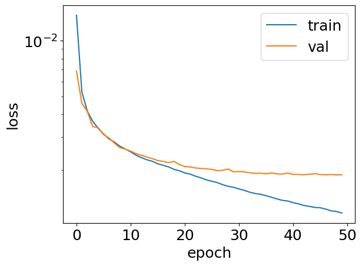
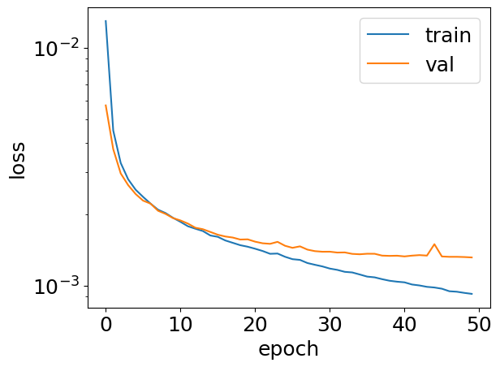
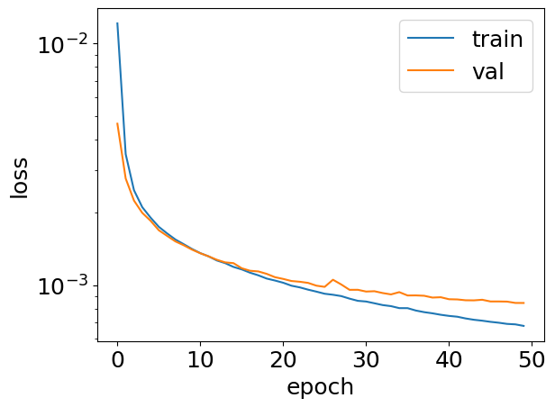
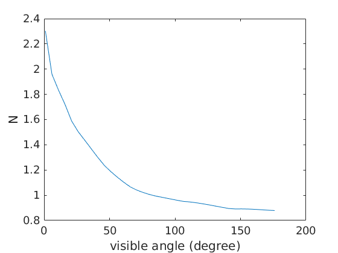
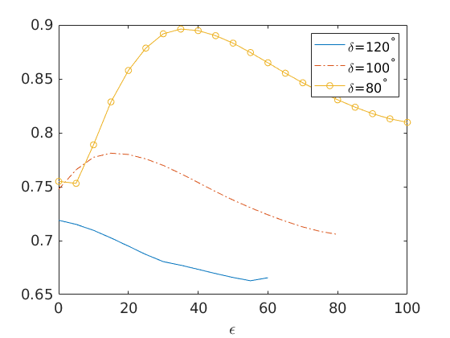

# Robustness of Limited Angle Tomography

Code for limited angle tomography with a simple U-net structure.

## Training loss
  
| 80 degrees| 100 degrees | 120 degrees |
|:---------:|:---------:|:---------:|
|  |  |  |

## Estimated class of data set

|Estimate of Data Parameters| Estimate of Stability Constant|
|:-------------------------:|:-----------------------------:|
|||

